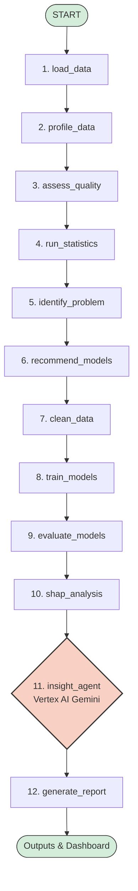

# 🤖 Autonomous Data Scientist Agent (ADSA)

[](https://google.github.io/adk/)
[](https://cloud.google.com/vertex-ai)
[](https://streamlit.io/)
[](https://www.python.org/)

**Autonomous Data Scientist Agent (ADSA)** is an end-to-end autonomous machine learning and data analysis pipeline built on the **Google Agent Development Kit (ADK 2.0)**. 

Unlike traditional conversational LLM agents that execute arbitrary code in unpredictable loops, ADSA leverages a deterministic **Graph Workflow**. Data flows sequentially through specialized Python nodes—conducting automated data cleaning, statistical testing, anomaly detection, heuristic problem identification, AutoML model training, and SHAP explainability analysis—before engaging **Google Vertex AI (Gemini 2.5 Flash)** to synthesize findings into an executive-ready business report and interactive RAG chat dashboard.

---

## ✨ Key Features

- 📊 **Autonomous Data Profiling**: Instantly extracts fundamental metadata, memory footprint, schema data types, missing value percentages, quartiles, and Pearson correlation matrices.
- ⚠️ **Heuristic Quality Assessment**: Detects missing value severity, IQR (Interquartile Range) outliers, and severe multicollinearity using deterministic mathematical rules without LLM hallucination risks.
- 📈 **Rigorous Statistical Testing**: Executes automated hypothesis testing via `scipy.stats`, including Shapiro-Wilk normality tests, Chi-Square tests for categorical independence, and Welch's T-Test / One-Way ANOVA for feature relationships.
- 🎯 **Intelligent Problem Detection & Target Override**: Automatically infers whether the machine learning task is **Classification**, **Regression**, or **Clustering** based on cardinality and feature distributions. Supports explicit user target overrides (`--target price`).
- 🤖 **Built-in AutoML Engine**: Dynamically instantiates, trains, and evaluates Scikit-Learn models (Random Forest, Gradient Boosting, Logistic Regression, Linear Regression, K-Means, etc.) on stratified train/test splits, automatically selecting the champion model based on task-specific metrics (Accuracy, RMSE, Silhouette Score).
- 💡 **SHAP Explainability**: Interrogates trained models using SHAP (SHapley Additive exPlanations) to determine global feature importance and generates visual summary plots.
- 📝 **Gemini AI Synthesis**: Feeds clean statistical JSON payloads into Google Vertex AI (Gemini 2.5 Flash), translating complex P-values, RMSE scores, and SHAP drivers into actionable business strategies and structured executive markdown reports.
- 🖥️ **Interactive Web Dashboard & Chat**: A sleek **Streamlit** web application featuring drag-and-drop dataset upload, side-by-side report and interactive Plotly chart rendering, and an embedded RAG chat assistant to interrogate your results in real time.

---

## 🏛️ System Architecture & Workflow

ADSA orchestrates data flow through a strict 12-node Directed Acyclic Graph (DAG):



---

## 📂 Project Structure

```text
adsa/
├── .env                       # Vertex AI & GCP configuration
├── pyproject.toml             # Python dependencies (managed by uv)
├── app_ui.py                  # Streamlit Interactive Web Dashboard & Chat
├── datasets/                  # Included sample datasets
│   ├── Housing.csv            # Real estate regression dataset (545 rows)
│   └── sample.csv             # Customer demographics dataset (10 rows)
├── outputs/                   # Generated artifacts (charts, models, reports)
│
└── app/
    ├── agent.py               # Exposes the ADK App to the CLI/Runner
    ├── graph.py               # Defines the ADK DAG routing & edges
    │
    ├── utils/
    │   ├── schemas.py         # Strict Pydantic models for LLM output schemas
    │   └── visualize.py       # Plotly interactive chart generation
    │
    ├── nodes/
    │   ├── loading.py         # Data ingestion & CLI target parsing
    │   ├── profiling.py       # Statistical distributions & correlation matrix
    │   ├── quality.py         # Heuristic missing value & outlier detection
    │   ├── statistics.py      # Shapiro-Wilk, Chi-Square, & ANOVA tests
    │   ├── problem_detection.py # Task inference (Classification/Regression/Clustering)
    │   ├── model_recommender.py # Algorithm selection heuristics
    │   ├── cleaning.py        # Imputation, One-Hot Encoding, & Parquet storage
    │   ├── training.py        # Train/test splitting & dynamic model training
    │   ├── evaluation.py      # Metric scoring & champion model persistence
    │   ├── shap_analysis.py   # SHAP value computation & feature importance
    │   └── report.py          # Final report assembly & chart linking
    │
    └── agents/
        └── insight_agent.py   # Gemini LlmAgent configured for Vertex AI ADC
```

---

## 🚀 Getting Started

### Prerequisites

1. **Python 3.12+**
2. **[uv](https://docs.astral.sh/uv/)**: Ultra-fast Python package manager.
   ```bash
   curl -LsSf https://astral.sh/uv/install.sh | sh
   ```
3. **Google Cloud SDK**: For Google Cloud / Vertex AI authentication.
   ```bash
   # Install gcloud CLI, then authenticate:
   gcloud auth application-default login
   ```

### Installation

1. Clone the repository and navigate into the project directory:
   ```bash
   git clone https://github.com/your-username/adsa.git
   cd adsa
   ```

2. Install all dependencies using `uv`:
   ```bash
   uv sync
   ```

3. Configure your environment variables by creating or updating `.env`:
   ```env
   GOOGLE_CLOUD_PROJECT="your-google-cloud-project-id"
   GOOGLE_CLOUD_LOCATION="us-central1"
   GOOGLE_GENAI_USE_VERTEXAI="True"
   ```

---

## 💻 Usage

### Option 1: Interactive Web Dashboard (Recommended)

Launch the Streamlit web interface for a rich, visual experience:

```bash
uv run streamlit run app_ui.py
```

1. Open your browser to **`http://localhost:8501`**.
2. **Upload Dataset**: Drag and drop any `.csv` or `.parquet` file (e.g., `datasets/Housing.csv`).
3. **Set Target**: Optionally specify the target variable to predict (e.g., `price`). Leave blank for automatic heuristic detection.
4. **Run Analysis**: Click **Run Full Pipeline** and watch ADSA profile, clean, train, and evaluate models in real time.
5. **Explore & Chat**: View the side-by-side executive report and interactive Plotly charts, then scroll down to the built-in AI chat box to interrogate the results!

---

### Option 2: Command Line Interface (CLI)

Run ADSA silently in the terminal using the Google Agents CLI or ADK runner:

```bash
# Auto-detect target variable:
uv run agents-cli run "datasets/sample.csv"

# Explicitly specify target variable for regression:
uv run agents-cli run "datasets/Housing.csv --target price"
```

Once execution completes, check the `outputs/` directory for:
- `final_report.md`: The executive analytical report written by Gemini.
- `best_model.pkl`: The serialized Scikit-Learn champion model.
- `shap_summary.png`: Global feature importance chart.
- `*.html`: Interactive Plotly charts (correlations, distributions).

---

## 🧪 Included Datasets

The repository comes pre-packaged with two sample datasets in `datasets/`:
1. **`Housing.csv`** (545 rows, 13 columns): A classic real estate dataset. Ideal for testing **Regression** workflows by predicting property `price` based on area, bedrooms, bathrooms, stories, and amenities.
2. **`sample.csv`** (10 rows, 7 columns): A small customer demographics dataset with intentional missing values and high multicollinearity. Ideal for testing defensive imputation, edge-case handling, and **Classification** workflows.

---

## 🛠️ Technology Stack

- **Orchestration**: Google Agent Development Kit ([ADK 2.0](https://google.github.io/adk/))
- **LLM / AI**: Google Vertex AI (`gemini-2.5-flash`) via Application Default Credentials (ADC)
- **Data Processing**: Pandas, NumPy, Scipy, PyArrow / Parquet
- **Machine Learning**: Scikit-Learn, Joblib
- **Explainable AI**: SHAP (SHapley Additive exPlanations)
- **Visualization**: Plotly, Matplotlib
- **Frontend Dashboard**: Streamlit
- **Package Management**: Astral `uv`

---

## 📄 License

This project is licensed under the MIT License. See the [LICENSE](LICENSE) file for details.
